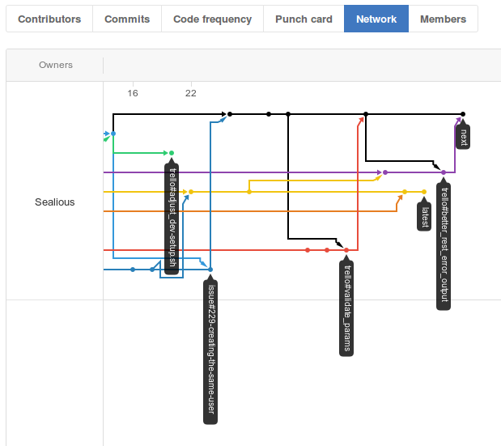
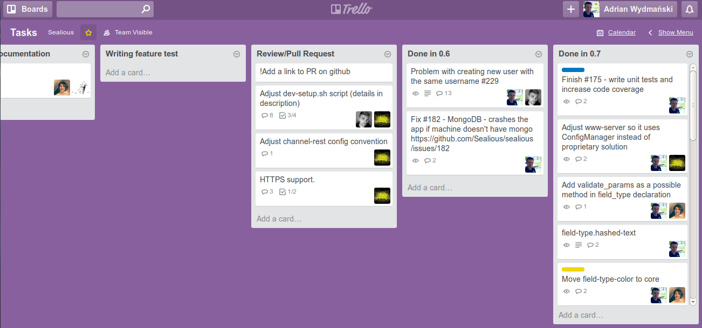

Prezentacja rozwiązań ułatwiających szybkie rozwijanie aplikacji oraz wspomagających pracę docelowych developerów.
==================================================================================================================

Wstęp
-----

Sealious jest to open-source'owy, wysoce deklaratywny framework
umożliwiający tworzenie aplikacji webowych i desktopowych. Naszym celem
jest stworzyć użyteczne narzędzie, które pozwala docelowemu programiście
skupić się na tym **jaki** ma być końcowy efekt, a nie **jak** go
osiągnąć.

Pragniemy, aby Sealious był tworzony nie tylko „przez programistów, dla programistów”, ale przede
wszystkim przez ludzi, dla ludzi. Jest on wyrazem naszego dążenia do
zwiększenia wolności wyboru dla konsumentów oraz obniżania progu wejścia
dla aspirujących programistów. Chcemy także, aby stał Sealious się
przydatnym narzędziem również dla nas, jako zespołu, do przyszłego
tworzenia oprogramowania.

*\
„Cóż bowiem za korzyść odniesie człowiek,\
choćby cały świat zyskał,\
a na swej duszy szkodę poniósł?”\
*\
Ewangelia Mateusza 16:26

Część I
-------

Rozwiązania ułatwiające szybkie rozwijanie aplikacji
----------------------------------------------------

Praca nad projektem inżynierskim uzmysłowiła naszemu zespołowi jakie
problemy towarzyszą procesowi tworzenia nowych rozwiązań
programistycznych oraz jakich narzędzi oraz usług używać, aby usprawnić
pracę nad kodem. Zdobyte doświadczenie pozwoliło nam wypracować dobrze
działający *workflow*, który wspomaga naszą pracę i zwiększa naszą
produktywność. Poniższa część zawiera opis następujących puntków:

1.  **Problemy związane z rozwijaniem projektów informatycznych** – opis
    trzech problemów związanych z rozwijaniem projektów informatycznych,
    które moim zdaniem przeszkadzają w produktywnej pracy nad
    projektem informatycznym.

2.  **Organizacja pracy** – dzięki konsekwencji w spotkaniach oraz
    przyjaznym otoczeniu, jesteśmy w stanie pomagać sobie nawzajem i
    dodawać sobie motywacji.

3.  **System kontroli wersji** – serwis przeznaczony do *hostowania*
    projektów informatycznych wykorzystujący system kontroli wersji Git.
    Na nim przechowywane jest repozytorium naszego kodu, na nim również
    pojawiają się zgłoszenia o błędach.

4.  **Zarządzanie zadaniami** – opis narzędzia do produktywności
    **Trello**, które pomaga zorganizować propozycje zmian w projekcie.

5.  **Wersjonowanie i npm** - domyślny menadżer modułów dla środowiska
    Node.js, na którym opublikowany jest Sealious, narzuca również
    wersjonowanie projektu.

6.  **Testy oprogramowanie i ciągła integracja** – dobrze napisane testy
    kodu źródłowego pomagają walidować istniejący kod oraz zmiany, które
    mają zostać dodane. Usługa ciągłej integracji pozwali zautomatyzować
    ten proces.

### Problemy związane z rozwijaniem projektów programistycznych

W trakcie tworzenia projektu inżynierskiego wystąpiło kilka problemów,
które utrudniały pracę nad nim. Wbrew pozorom, największe kłopoty nie
były związane z kwestiami technicznymi, takimi jak brak systemu kontroli
wersji, czy nie napisanie testów jednostkowych, dzięki którym można
sprawdzić, czy zmiany w kodzie nie destabilizują cały projekt.
Oczywiście te problemy powinny zostać rozwiązane jak najszybciej, jednak
są one stosunkowo łatwe do rozwiązanie.\
O wiele poważniejsze problemy to te, które nazwałbym problemami
„miękkimi”, tj. problemami z organizacją pracy i jej przebiegiem.

W tym rozdziale zajmę się trzema problemami, które powinny być jak
najszybciej zneutralizowane:

1.  **Brak zaangażowania członków grupy** – bez zaangażowania projekt
    nie posiada taką ilość uwagi jaką powinien, przez to efekty pracy
    są niewystarczające.

2.  **Brak osoby, która zarządza projektem** – osoba, która posiada
    zdolności przywódcze i koordynacyjne bardzo często pomaga
    zmobilizować zespół, dzięki temu projekt przebiega o wiele
    sprawniej.

3.  **Brak umiejętnego zarządzania zadaniami** – niepraktyczne
    rozplanowanie kolejnych etapów tworzenia oprogramowania znacznie
    utrudnia rozwój projektu.

1\. Brak zaangażowania członków grupy

Brak osób chętnych do wykonania jakiekolwiek projektu jest największym
problemem, którego wbrew pozorom nie jest tak łatwo rozwiązać. Bardzo
często osoby, które są przymuszane do zrobienia danej rzeczy, robią to
niestarannie i źle. Powoduje to irytację wśród osób, które są
zaangażowane w pracę nad projektem, przez co spada motywacja grupy jako
całości. Zazwyczaj w takich sytuacjach tworzą się podgrupy w grupie
projektowej, co już samo w sobie jest niepożądane w zespole: ci, którym
zależy i ci, którym nie zależy. Zazwyczaj ci pierwsi są w mniejszości,
wykonują większość pracy i mają złe zdanie o tych drugich.

Nie ma jednej recepty na brak zaangażowania. Najłatwiejszym i
najbardziej oczywistym rozwiązaniem jest podziękowanie za współpracę,
jednak nie zawsze jest to możliwe. Poza tym nie zawsze jest to dobre
rozwiązanie problemu – eliminuje się osoby, które zawadzają, jednak
niektórzy mają problem z jasnym wyrażeniem swojego oburzenia i bardzo
często takie osoby są traktowane jako „kula u nogi” i są trzymane w
grupie do końca trwania projektu.

Inną możliwością jest prywatna rozmowa przeprowadzona przez lidera, bądź
osobę odważną na tyle, by z osobą niezaangażowaną porozmawiać. Istnieje
wtedy możliwość poprawy zachowania, wpływa też pozytywnie na integrację
zespołu (wywoływanie poczucia odpowiedzialności za innych).

Zazwyczaj ta druga opcja powinna być wykonana najpierw, a dopiero potem
można przejść do radykalnych środków.

2\. Brak osoby, która zarządza projektem

Ten problem pojawia się najczęściej wtedy, gdy nie ma w zespole dwóch
elementów:

1.  Osoby, która posiada posłuch wśród członków zespołu i swoją charyzmą
    potrafi przekonać innych do swojej racji.

2.  Temat jest narzucony z góry.

Kiedy w grupie nie ma osoby, która staje się liderem – osobą, która
postanawia zarządzać projektem, praca staje się uciążliwa i trudna do
wykonania, ponieważ nie ma autorytetu, który byłby siłą napędową grupy.
Demokracja jest przydatna wtedy, kiedy odbywa się „burza mózgów”\
i proponowane są rozwiązania danego problemu, natomiast samo prowadzenie
projektu powinno spocząć na barkach osoby, która posiada posłuch wśród
członków grupy. Wtedy praca staje się efektywna i łatwiejsza.\
Osoba, która bierze na siebie odpowiedzialność za projekt i czuje pewne
zobowiązanie do jego wykonania, jeżeli również posiada charyzmę i
posłuch wśród członków zespołu, potrafi stać się kimś, kto zapewni, że
praca nad projektem będzie trwała. Taka osoba potrafi zmotywować innych
do działania, nawet jeżeli brakuje im umiejętności potrzebnych do
wykonania danego im zadania.

Zazwyczaj osoba, która wychodzi z inicjatywą projektu jest tą osobą,
która nią zarządza, tj. wie jak projekt ma wyglądać, wie jaki ma być
końcowy wynik i stara się forsować kolejne zadania tak, aby końcowy
efekt, był jak najbliżej tego, co było zakładane na początku.\
Więcej o liderze w grupie projektowej znajduje się w rozdziale drugim.

\

3\. Brak umiejętnego zarządzania zadaniami

Niestety zaangażowanie członków grupy jak i posiadanie lidera, który
potrafi swoją osobowością trzymać projekt w ryzach nie wystarcza, aby
praca nad projektem była łatwa i przyjemna. Największym problemem jaki
dotyka niemal wszystkie grupy projektowe jest brak odpowiedniego planu
wykonania projektu. Umiejętne zarządzanie zadaniami jest tak samo ważne
dla projektu, jak ich wykonanie.\
Parafrazując Henry'ego Forda „Nic nie jest szczególnie trudne do
wykonania, jeżeli podzieli się pracę na małe zadania”^\[1\]\\ ^- te
słowa sprawdziły się w czasie produkcji pierwszych samochodów,
sprawdzają się też podczas zarządzania projektami. Rozłożenie projektu
na poszczególne kroki, czy kamienie milowe, sprawia, że łatwiej skupić
się na szczegółach, które tworzą całość. Wykonanie pomniejszych zadań
podnosi również morale, gdyż pojawia się możliwość częstszego
celebrowania sukcesów.\

\[1\] „Nothing is particularly hard if you divide it into small jobs”.

### Organizacja pracy – spotkania, komunikacja, narzędzia

Zorganizowana grupa, to skuteczna grupa. Z moich obserwacji oraz z 
efektów pracy naszego zespołu wynika, że jedną z najważniejszych rzeczy
o jakiej należy pomyśleć zaraz po zrzeszeniu ludzi o podobnych poglądach
i zaangażowaniu, jest dobre przemyślenie jak zorganizować grupę tak, aby
praca była jak najefektywniejsza, ale i satysfakcjonująca.
Nie należy też zapominać o integracji, która pomaga członkom grupy
nawiązywać bliższe relacje, co ułatwia komunikację i motywuje do dalszej
pracy.

Nic nie jest bardziej zniechęcające niż nieprzyjemna atmosfera w miejscu
pracy. Naciskanie na efekty pracy, brak wyrozumiałości, egoizm i
zarozumiałość – to wszystko niszczy dobre relacje między członkami grupy
i ma negatywny wpływ na efekty pracy. Dlatego podstawą jest zapewnienie
luźnych, swobodnych relacji wewnątrz grupy.

W czasie formowania się grupy, w sposób naturalny wyłania się jej lider.
Zazwyczaj jest to pomysłodawca, który jest na tyle pewny swojego
pomysłu, że angażuje innych ludzi do projektu. Problem jaki może w tym
miejscu wystąpić jest bycie „szefem”, a nie jego liderem. Różnicę między
szefem a liderem pokazuje poniższa grafika.\


Innym potencjalnym problemem jest niedostateczne zaangażowanie innych
członków, bądź nieumiejętne przekazanie idei projektu reszcie. Wtedy,
jeżeli z jakiegoś powodu, lider grupy nie może uczestniczyć w spotkaniu,
reszta grupy ma problem z kontynuowaniem projektu.\
W przypadku naszego projektu, sposób zorganizowania pracy zmieniał się w
czasie. W drugim semestrze projektu inżynierskiego spotkania odbywały
się we wtorki i trwały średnio pięć godzin. W tym czasie dyskutowaliśmy
co nam się udało zrobić w ciągu tygodnia, robiliśmy *code-review *(o
którym więcej w rozdziale trzecim), ustanawialiśmy cele, rozwiązywaliśmy
problemy kolegów. Nie zabrakło też elementów integracji – luźnych rozmów
i dyskusji na tematy niezwiązane z projektem, żartów i oglądaniu
krótkich filmów w internecie.

### System kontroli wersji

Jednym z najważniejszych elementów ułatwiających pracę programistyczną
jest wdrożenie systemu kontroli wersji, czyli „oprogramowania służącego
do śledzenia zmian głównie w kodzie źródłowym oraz pomocy programistom w
łączeniu zmian dokonanych w plikach przez wiele osób w różnych momentach
czasowych.”^\[1\]^. Obecnie praca bez takiego systemu jest znacznym
problemem, ponieważ bez niego o wiele trudniej synchronizować kod
pomiędzy programistami działającymi w danym projekcie

Jedną z najpopularniejszych systemów kontroli wersji jest Git napisany
przez Linusa Torvaldsa, który został wydany w 2005. Jego prosta i
łatwość w przyswojeniu przyczyniła się do ogólnoświatowej popularności.

Praca nad naszym projektem inżynierskim była w znacznym stopniu
przyspieszona dzięki użyciu systemu **Git**. Udało nam się również
przetestować jaki rodzaj *workflow* jest dla nas bardziej efektywny.

Początkowo, od rozpoczęcia projektu do sierpnia 2015, stosowaliśmy
następującą konwencję:

-   Dwa główne *branche*:
    -   *master* - stabilna wersja kodu, dostępna poprzez ekosystem
        **npm**.

    -   *dev* - nowe funkcjonalności oraz zmiany, które mają w przyszłości
        stać się stabilną wersją poprzez operację *git merge* do „master”,
        dostępna poprzez ekosystem **npm**.

-   *Branche* zawierające nowe funkcjonalności, bądź zmiany w kodzie
    nazywane były w następujący sposób: *issue\#xxx\_description*, gdzie
    *xxx* to numer *issue* na **GitHubie**, a *description *to krótki
    opis dokonywanej zmiany. Po ukończeniu zadania tworzony był *pull request*, który był
    rozpatrywany przez inną niż autor osobę z zespołu. Jeżeli zmiana
    został zatwierdzona, dokonywana była operacja *git merge* do
    *brancha*, w którym miała być przeprowadzona zmiana.

Nazewnictwo mniejszych *branchy *zostały wymyślone przez nas, aby
ułatwić rozwiązywanie zadań. Początkowo wszystkie propozycje zmian oraz
zgłaszanie błędów było dodawane poprzez *issue* na platformie
**GitHub**.

\
Pomiędzy czerwcem, a sierpniem 2015, pojawiły się w zespole propozycje
zmiany systemu pracy. Padła wtedy propozycja, aby *branch* „master”
zmienił nazwę na „latest”, a *branch* „dev” na „next”. Choć nowe
nazewnictwo powodowało początkowo trudności w zrozumieniu i
zapamiętaniu, postanowiliśmy je przyjąć, aby przetestować jego
użyteczność.\
Dodatkowo skorzystaliśmy z narzędzia o nazwie **Trello**, o którym mowa
w rozdziale 4, na które przenieśliśmy wszystkie propozycje zmian tak,
aby sekcja *issue* na **GitHubie** zawierała tylko zgłoszenia błędów. W
tej formie konwencja wyglądała następująco:

-   Dwa główne *branche*:

    -   *latest* - stabilna wersja kodu, dostępna poprzez ekosystem **npm** 
        (więcej o dostępności poprzez ekosystem **npm** w rozdziale
        5.),

    -   *next* - nowe funkcjonalności oraz zmiany, które mają w
        przyszłości stać się stabilną wersją, dostępna poprzez ekosystem
        **npm**.

-   Branche zawierające nowe funkcjonalności zaproponowane na *Trello*
    posiadają nazwę *trello\#description*, a te które naprawiają błędy
    zgłoszone w *issue* mają nazwę *issue\#xxx\_description*. Po ukończeniu zadania tworzony był *pull request*, który był
    rozpatrywany przez inną niż autor osobę z zespołu. Jeżeli zmiana
    został zatwierdzona, dokonywana była operacja *git merge* do
    brancha, w którym miała być przeprowadzona zmiana.

Na przełomie listopada i grudnia 2015 roku, na platformie **Trello**
przeprowadzona została dyskusja o zmianie nazewnictwa głównych branchy,
która ostatecznie przerodziła się w zatwierdzenie nowego *workflow,
*które ma wejść w życie w styczniu 2016 roku, tym razem opierającego się
na **trzech** głównym branchach:

-   -   *stable* - stabilna wersja kodu (poprzednio „latest”), dostępna
        poprzez ekosystem **npm**,

    -   *beta* – wersja zawierająca wszystkie zaplanowane zmiany w danej
        wersji, udostępniona użytkownikom do testów (poprzednio brak),
        dostępna poprzez ekosystem **npm**,

    -   *alpha* – każda nowa funkcjonalność, bądź poprawa istniejących
        funkcji, dostępna jedynie poprzez **GitHub**.

-   Nazwy pozostałych *branchy* są niezmienione.

Sama praca z systemem **Git **wygląda następująco:

-   Tworzony jest nowy branch, na którym przeprowadzone są zmiany, ich
    konwencja nazw podana jest wyżej.

-   Po dokonaniu zmian, autor tworzy *pull request*, który jest
    rozpatrzony przez członka zespołu niebędącym współautorem zmian.

-   Jeżeli kod nie zawiera błędów, dokonywana jest operacja *git merge* do
    *brancha*, w którym ma zajść zmiana.

Poniższa grafika przedstawia fragment grafu *commitów* na platformie **GitHub**.
Widać na nim główne *branche* - „next” i „latest”, oraz inne,
pomniejsze, które zawierają zmiany w kodzie.




\[1\] https://pl.wikipedia.org/wiki/System\_kontroli\_wersji

### Zarządzanie zadaniami

Rozplanowane i dobrze przemyślanie pomysły powinny zostać umieszczone w
miejscu, do którego każdy członek zespołu ma dostęp. Czasem zanotowanie
ich na tablicy i przepisanie na kartkę papieru, bądź napisanie maila do
wszystkich zainteresowanych osób nie wystarczy. Na szczęście istnieje
wiele dostępnym narzędzi do produktywności i jedno z nich zastosowaliśmy
w naszym projekcie – **Trello**. Daje ono możliwość stworzenia list do
przechowywanie kart, na których można zapisać zadania, pomysły,
propozycje zmian, dodać do nich ankietę, przypisywać członków grupy, czy
też ustawić *deadline*. Strona te umożliwia również dodawanie komentarzy
do kart, dzięki czemu każdy kwestia może być przedyskutowana przez
każdego z członków zespołu.

Poprzednio wszystkie propozycje zmian znajdowały się w naszym
repozytorium na platformie **GitHub** jako *issue*. Zrezygnowaliśmy z
takiego podejścia, ponieważ uznaliśmy, że zwykły użytkownik nie będący w
zespole projektowym nie musi być na bieżąco ze wszystkimi zmianami oraz
wewnętrznymi dyskusjami o projekcie. Dlatego postanowiliśmy skorzystać z
**Trello** do lepszego zarządzania zadaniami.

Obecnie (grudzień 2015) posługujemy się kilkunastoma listami, ich układ
jest eksperymentalny i ciągle podlega zmianom. Oto najciekawsze z nich:

-   **To do in the future** – zmiany, które chcemy wprowadzić w Sealiousie w
    przyszłości.

-   **To do in next version** – zmiany, które chcemy wprowadzić w Sealiousie
    w następnej wersji.

-   **Hotfixes in the stable version** – zmiany, które mają być wprowadzone
    w obecnej wersji projektu.

-   **Soft tasks** – propozycje zmian niezwiązanych z programowaniem (np.
    zmiana nazewnictwa *branchy*).

-   **Ongoing** – zadania, które w danej chwili są wykonywane.

-   **Review/Pull Request** – zadania, które zostały wykonane i są do
    rozpatrzenia (*code review*).

-   **Done in 0.6** – zadania wykonane w wersji 0.6.

-   **Done in 0.7** – zadania wykonane w wersji 0.7.

-   **Otherwise closed** – wykonane zadania, które nie są bezpośrednio
    związane z programowaniem.



### Wersjonowanie i npm

**npm** jest to domyślny menadżer pakietów, zwanych również modułami,
dla środowiska Node.js, które automatycznie go instaluje od wersji
0.6.3. Menadżer ten jest dostępny z poziomu linii komend i używany jest
do zarządzania zależnościami w aplikacji. Aby zainstalować dany moduł
wystarczy wpisać *\$ npm install moduleName*.

Ponieważ nasz projekt jest pisany w języku JavaScript z użyciem Node.js,
postanowiliśmy opublikować go na platformie **npm**, która wymaga
zastosowania następującego wersjonowania^\[1\]^:

semver

Zakładając, że projekt ma wersję 1.0.0:

-   Naprawa błędow i inne pomniejsze zmiany: „Patch release” -
    zwiększenie ostatniej cyfry o jeden: 1.0.1.

-   Nowe zmiany, które nie kolidują z istniejącymi funkcjonalnościami:
    „Minor release” - zwiększenie środkowej cyfry o jeden: 1.1.0.

-   Zmiany, które kolidują z istniejącymi funkcjonalnościami (np. brak
    kompatybilności wstecznej): „Major release” - zwiększenie pierwszej
    cyfry o jeden: 2.0.0.

Wersje projektu zmieniane są w pliku *package.json*, który zawiera
podstawowe informację wykorzystywane przez **npm**. Plik ten można
najbezpieczniej utworzyć wpisując komendę *\$ npm init* w katalogu, w
którym chcemy tworzyć projekt.

W naszym projekcie istniało kilka sposobów wersjonowania związanych z
*workflow* wymienionych w rozdziale 3:

1.  Workflow z głównymi branchami „master” i „dev”:

-   Zmiany w branchu „master” trafiały na platformę **npm** ze
    zwiększoną środkową cyfrą po operacji *git merge*.

-   Zmiany w branchu „dev” nie trafiały na platformę **npm**.

    *Przykład*: Stabilna wersja projektu: 0.7.0. Branch „dev” zawiera
    nową funkcjonalność, której nie zawiera branch „master”. Po
    dokonaniu operacji *git merge* z „dev” do „master”, zwiększona zostaje
    środkowa cyfra – 0.8.0, zmiany są publikowane.

1.  Workflow z głównymi branchami „latest” i „next”:

-   Branch „latest” zawierał ostatnią wersję z brancha „next” przed
    operacją *git merge* z „next” do „latest”. Po dodaniu ewentualnej łatki,
    zwiększona zostaje ostatnia cyfra i zmiany są publikowane na
    platformie **npm**.

-   Zmiany w branchu „next” trafiały na platformę **npm **ze zwiększoną
    ostatnią cyfrą po każdej zmianie.
    
    *Przykład 1*: Praca nad branchem „next”, wersja projektu 0.7.8. Po
    dodaniu nowej funkcjonalności zwiększona zostaje ostatnia cyfra –
    0.7.9, projekt jest publikowany.
    
    *Przykład 2*: Praca nad branchem „next”, wersja projektu 0.7.15. Po
    dodaniu wszystkich funkcjonalności w danej wersji, zostaje dokonana
    operacja *git merge* z „next” do „latest”. Po tej operacji, wersja
    projektu na branchu „latest” to 0.7.15, natomiast na branchu „next”
    rozpoczynają się pracę nad wersją 0.8.0.

1.  Workflow z głównymi branchami „stable”, „beta”, „alpha”.

-   Branch „stable” w założeniu ma być ustabilizowany i nie
    zawierać zmian. W razie pojawienia się łatki, zwiększona zostanie
    ostatnia cyfra i zmiana zostanie opublikowana na platformie **npm**.

-   Zmiany w branchu „beta” trafią na platformę **npm** ze zwiększoną
    środkową cyfrą po każdej zmianie.

-   Zmiany w branchu „alpha” nie trafią na platformę **npm **(dostęp
    tylko poprzez GitHub).
    
    *Przykład 1*: W brancha „alpha” dodana jest nowa funkcjonalność.
    Wersja projektu się nie zmienia.\
    
    *Przykład 2*: Wersja na branchu „beta”: 0.8.2. Po dodaniu wszystkich
    funkcjonalności do brancha „alpha”, zostaje dokonana operacja *git merge
    *z „alpha” do „beta”. Wersja projektu na branchu „beta” zmienia się
    do 0.9.0.
    
    *Przykład 3*: Wersja projektu na branchu „beta”: 0.9.0. Zostaje
    zgłoszony błąd, który zostaje naprawiony. Wersja projektu zmienia
    się do 0.9.1, zmiana zostaje opublikowany.
    
    *Przykład 4*: Wersja projektu na branchu „stable”: 0.8.2, na branchu
    beta: 0.9.1. Po uznaniu, że wersja na branchu „beta” jest stabilna,
    dokonana zostaje operacja *git merge* z „beta” do „stable”. Wersja
    projektu na branchu „stable”: 0.9.1.

Ostatni sposób wersjonowania jest ze wszystkich najbardziej optymalny,
bowiem użytkownik dostaje dwa gotowe produkty: jeden stabilny, drugi
zawierający najnowsze funkcjonalności, które przeszły testy wewnętrzne
(choć mogące zawierać błędy, których nie udało się wychwycić wcześniej).

\[1\] https://docs.npmjs.com/getting-started/semantic-versioning

### Testowanie oprogramowania i ciągła integracja

Testowanie kodu jest przydatnym narzędziem pozwalającym zweryfikować
poprawność napisanego kodu. Ustalenie jak kod powinien wyglądać, 
jak ma się zachować, jakie wyniki ma zwracać i
zaimplementowanie tego w postaci testów pokrycia pomaga na bieżąco
walidować nowe zmiany w projekcie oraz zapewniają, że testowany program
działa tak jak powinien. Napisanie testów pokrycia pomaga również wykryć
istniejące błędy jeszcze w fazie tworzenia oprogramowania.

Testy powinny być pisane zawsze, do każdego projektu. Ręczne
sprawdzenie, czy kod działa poprawnie jest zajęciem żmudnym i podatnym
na błędy, łatwo bowiem pominąć, bądź zapomnieć o przypadku użycia.
Automatyzacja jest w tym przypadku jak najbardziej pożądana.

W naszym projekcie inżynierskim testy jednostkowe są kluczowym elementem
sprawdzania poprawności zmian. Jeżeli proponowana zmiana nie przechodzi
poprawnie wszystkich testów, tj. wynik końcowy jest inny od oczekiwanego,
oznacza to, że zmiana ta jest niezgodna z obowiązującymi w danej wersji 
funkcjonalnościami i powinna być poprawiona tak, aby testowany kod wykonywał
się poprawnie. Obecnie w naszym projekcie znajduje się 155 testów, 
które pokrywają 82% kodu źródłowego, obejmujące przede wszystkim funkcjonalności 
odpowiedzialne za obsługę zasobów:\


Testy jednostkowe pisane są za pomocą *frameworka* **MochaJS**, który
znacząco ułatwia sam proces tworzenia testów:

```js
describe('Array', function() {
    describe('#indexOf()', function() {
        it('should return -1 when the value is not present', function() {
            [1,2,3].indexOf(5).should.equal(-1);
            [1,2,3].indexOf(0).should.equal(-1);
        });
    });
});
```

Powyższy przykład sprawdza, czy tablica `[1,2,3]` zawiera elementy `5` i `0`.
Każdy test powinien być przyporządkowany do odpowiedniej kategorii tak,
aby użytkownik przeprowadzający test bez problemu wiedział jaki obszar
kodu w dalej chwili podlega testom. Służy do tego funkcja `describe()`,
która jako pierwszy argument posiada nazwę kategorii, do której zostanie przypisany
test. Drugim argumentem jest funkcja `callback`, w której mogą znajdować się
wielokrotne wywołanai funkcji `describe()`.

Funkcją odpowiedzialną za samo przeprowadzenie testu jest `it()`, która jako
pierwszy argument powinna przyjmować dokładny opis przeprowadzanego testu,
zaś drugim argumentem jest funkcja `callback`, w której dokonuje się testu.
Może ona również zawierać argument, który określa koniec koniec testu.

#### Przykłady testów jednostkowych w Sealiousie

`FieldType.Email` jest to deklaracja typu pola zasobu "email", który
akceptuje tylko ciągi znaków mające strukturę adresu *email*:

```js
1   var Sealious = require("sealious");
2   var Promise = require("bluebird");
3
4   var field_type_email = new Sealious.ChipTypes.FieldType({
5       name: "email",
6       get_description: function(context, params){
7           return "Email address, like something@something.sth"
8       },
9       is_proper_value: function(accept, reject, context, params, value){
10          var address = value;
11
12          var regex = /^(([^<>()[\]\\.,;:\s@\"]+
            (\.[^<>()[\]\\.,;:\s@\"]+)*)|(\".+\"))@((\[[0-9]{1,3}\.
            [0-9]{1,3}\.[0-9]{1,3}\.[0-9]{1,3}\])|
            (([a-zA-Z\-0-9]+\.)+[a-zA-Z]{2,}))$/;
13
14          if (!regex.test(address)) {
15              reject(address + " is not valid e-mail address.");
16          } else {
17              accept();
18          }
19      }
20  });
```

Do powyższego fragmentu kodu zostały napisane trzy testy jednostkowe,
pokrywające każdą funkcjonalność:

```js
1   describe("FieldType.Email", function() {
2       it("should return the description of the field type", function(done) {
3           if (typeof field_type_email.declaration.get_description() === "string")
4               done();
5           else
6               done(new Error("But it didn't"));
7       });
8       it("should check if is_proper_value works correctly" + 
           "(given correct date format)", function(done) {
9           field_type_email.is_proper_value(new Sealious.Context(), {}, "test@mail.com")
10          .then(function() {
11              done();
12           })
13          .catch(function(error) {
14              done(new Error(error));
15           })
16      });
17      it("should check if is_proper_value works correctly" + 
         "(given incorrect date format)", function(done) {
18          field_type_email.is_proper_value(new Sealious.Context(), {}, "test")
19          .then(function() {
20              done(new Error("It worked correctly"));
21          })
22          .catch(function(error) {
23              if (error.type === "validation")
24                 done();
25              else 
26                done(new Error(error));
27          })
28      });
29  });
```

-   Pierwszy test jednostkowy sprawdza, czy deklaracja typu pola
    jest ciągiem znaków, jeżeli jest, to test wykona się poprawnie,
    jeżeli nie, to zostanie zwrócony błąd:

    ```js
    it("should return the description of the field type", function(done) {
        if (typeof field_type_email.declaration.get_description() === "string")
            done();
        else
            done(new Error("But it didn't"));
    });
    ```

-   Drugi test jednostkowy sprawdza, czy weryfikacja adresu email `test@mail.com`
    przeszła poprawnie, jeżeli nie, to zwrócony zostanie błąd:

    ```js
    it("should check if is_proper_value works correctly" +
       "(given correct date format)", function(done) {
        field_type_email.is_proper_value(new Sealious.Context(), {}, "test@mail.com")
        .then(function() {
            done();
        })
        .catch(function(error) {
            done(new Error(error));
        })
    });
    ```

-   Trzeci test jednostkowy sprawdza, czy typ pola odrzuci podany adres email `test`,
    jeżeli go zaakceptuje, to zwracany jest błąd:

    ```js
    it("should check if is_proper_value works correctly" + 
       "(given incorrect date format)", function(done) {
        field_type_email.is_proper_value(new Sealious.Context(), {}, "test")
        .then(function() {
            done(new Error("It worked correctly"));
        })
        .catch(function(error) {
            if (error.type === "validation")
                done();
            else 
                done(new Error(error));
        })
    });
    ```

Wywołanie powyższych testów w konsoli spowoduje wypisanie ich rezultatów: 

```
FieldType.Email
    should return the description of the field type
    should check if is_proper_value works correctly(given correct date format)
    should check if is_proper_value works correctly(given incorrect date format)
```

W przypadku błędego rezultatu, w konsoli zostanie wypisany komunikat:

```
1) FieldType.Email should check if is_proper_value works correctly(given incorrect date format):
     Error: It worked correctly
```


Mechanizmem ułatwiającym wykonywanie testów jednostkowych w naszym
projekcie jest usługa ciągłej integracji **Travis CI**, który wykrywa
zmiany w repozytorium na platformie **GitHub**, uruchamia nową wersję
projektu i wykonuje testy jednostkowe oraz ostatecznie wysyła maila
z rezultatem do osoby, która dokonała zmiany w repozytorium:\


### Podsumowanie części I

Początki pracy nad projektem nie były łatwe, ponieważ wówczas nie
mieliśmy wystarczająco dużo doświadczenia, aby wiedzieć jak efektywniej
i wydajniej pracować. Zaczęliśmy eksperymentować i próbować nowych
rzeczy, aby przekonać się, co okaże się dla nas najlepszym rozwiązaniem.
Z czasem udało nam się stworzyć działający *workflow*, który obecnie
jest wydajny i spełnia swoje zadania. Mimo tego ciągle jesteśmy
nastawieni na zmiany i szukanie nowych, lepszych rozwiązań. Obecnie
praca nad projektem wygląda następująco:

1.  Organizacja pracy – spotkania i komunikacja:

    -   Cotygodniowe spotkania projektowe, na których omawiamy bieżące
        sprawy.

    -   Praca we własnym zakresie w ciągu tygodnia.

    -   Komunikacja mailowa.

2.  Obecnie obowiązująca konwencja *branchy* w systemie kontroli wersji **Git**:

    1.  Główne *branche*:
        -   *stable* – stabilna wersja kodu, dostępna poprzez ekosystem
            **npm**.

        -   *beta* – wersja zawierająca wszystkie zaplanowane zmiany w
            danej wersji, udostępniona użytkownikom do testów, dostępna
            poprzez ekosystem **npm**.

        -   *alpha* – każda nowa funkcjonalność, bądź poprawa
            istniejących funkcji, dostępna jedynie poprzez **GitHub**.

    2.  Nazewnictwo *branchy* w których dokonywane są zmiany w kodzie:
        -   Jeżeli dane zadanie pochodzi z **Trello**:
            *trello\#opis\_zadania*.

        -   Jeżeli dane zadanie pochodzi z *issues* na platformie
            **GitHub**: *issue\#xxx\_opis\_zadania*, gdzie *xxx* to
            numer *issue*.

3.  Rozwój projektu – dodanie nowej funkcjonalności:

    1.  Wybór zadania z **Trello**.

    2.  Utworzone nowego *brancha* w systemie **Git **z odpowiednią
        nazwą, w którym będzie dokonana zmiana.

    3.  Praca nad zadaniem.

    4.  Ukończenie zadania, założenie *pull requesta*, przesunięcie do
        go listy „Review/Pull Request”.

    5.  Rozpatrzenie zadania przez innego członka zespołu, jeżeli kod
        jest poprawny, *git merge* do głównego *brancha*.

    6.  Zamknięcie *pull requesta*, *issue *(jeżeli zadania zostało
        również zgłoszone na platformie **GitHub**), przesunięcie
        zadania do listy „Done in &lt;version&gt;”.\

4.  Rozwój projektu – naprawienie błędu:

    1.  Wybór zadania z *issue* na **GitHub**.

    2.  Utworzenie nowego *brancha *w systemie **Git **z odpowiednią
        nazwą, w którym będzie dokonana zmiana.

    3.  Praca nad błędem.

    4.  Ukończenie zadania, założenie *pull requesta*, jeżeli błąd
        został wspomniany na **Trello** – przesunięcie zadania do listy
        „Review/Pull Request”.

    5.  Rozpatrzenie zadania przez innego członka zespołu, jeżeli kod
        jest poprawny, *git merge* do głównego *brancha*.

    6.  Zamknięcie *pull requesta*, *issue*, przesunięcie zadania do
        listy „Done in &lt;version&gt;” (jeżeli błąd został wspomniany
        na **Trello**).

5.  Rozwój projektu – opublikowanie nowej wersji:

    -   *Przykład 1*: Wersja projektu na branchu „beta”: 0.8.2. W
        branchu „alpha” znajdują się wszystkie zmiany w kodzie źródłowym
        projektu, które miały być dodane w ramach nowej wersji.
        Dokonywana jest operacja *git merge* z „alpha” do „beta”. Wersja
        projektu w branchu „beta” zmienia się na: 0.9.0, projekt zostaje
        opublikowany na platformie **npm**.

    -   *Przykład 2*: Wersja projektu na branchu „beta”: 0.9.0. Zostaje
        zgłoszony błąd, który następnie zostaje naprawiony. Wersja
        projektu zmienia się na 0.9.1, nowa wersja zostaje opublikowana
        na platformie **npm**.

    -   *Przykład 3*: Do *brancha* „alpha” zostaje dodana
        nowa funkcjonalność. Wersja projektu się nie zmienia, projekt
        nie jest publikowany na platformie **npm**.

    -   *Przykład 4*: Projekt w *branchu *„beta” ma wersję 0.9.3. Zespół
        uznaje, że wersja ta jest stabilna. Zostaje dokonana operacja
        *git merge* z „beta” do „stable”.

6.  Rozwój projektu – testy jednostkowe i pokrycia:

    -   Do każdej funkcjonalności dopisywane są testy jednostkowe, które
        weryfikują jej działanie, pomagają wykryć błędy i sprawdzają, 
        czy oprogramowanie działa poprawnie.

    -   W Sealiousie korzystamy z *frameworka* **MochaJS**, która
        ułatwia szybkie i dokładne pisanie testów.

Część II
--------

Rozwiązanie wspomagające pracę docelowych programistów
------------------------------------------------------

W dzisiejszych czasach przeciętny programista nie musi posiadać
dogłębnej wiedzy programowania niskopoziomowego, aby napisać
funkcjonalne, efektywne i przede wszystkim spełniające swoje zadanie
programy. Powodem tego stanu rzeczy jest ogromna ilość narzędzi
programistycznych, które ułatwiają pisanie kodu. Codziennie grupy
developerskie wypuszczają nową bibliotekę albo frameworka, które
ułatwiają życie setkom, jeżeli nie tysiącom, programistów na całym
świecie.

I chociaż nie można zaprzeczyć użyteczności owych narzędzi, głównym
problemem, który dotyka wielu użytkowników, jest problem z wdrożeniem
się w daną technologię.

Wynika on z niestarannego napisania dokumentacji technicznej,
niedoprecyzowania kroków instrukcji obsługi, czy braku sekcji
„Najczęściej zadawane pytania” (FAQ).

Brak podstawowych informacji o produkcie, z którego użytkownik korzysta,
napawa frustracją oraz zniechęca do korzystania z niego – jest to
podstawowa zasada każdego przedmiotu,\
z którego korzysta człowiek, nie ważne, czy to pralka, telewizor,
program komputerowy, czy samolot. Dlatego, w kontekście urządzeń
elektronicznych, w latach dziewięćdziesiątych powstała myśl filozoficzna
*User Experience*, którą można zdefiniować jako „całość wrażeń, jakich
doświadcza użytkownik podczas korzystania z produktu interaktywnego”.
^\[1\]^

Obecnie każda renomowana marka posiada specjalistów od User Experience,
którzy mają za zadanie upewnić się, czy dany produkt jest wystarczająco
użyteczny, łatwy do przyswojenia i intuicyjny dla przeciętnego
użytkownika. Powstaje więc pytanie, czy twórcy narzędzi
programistycznych też powinni upewnić się, że to co dają programistom
jest użyteczne, łatwe do przyswojenia i intuicyjne?

Odpowiedź brzmi: **tak**.

Poniższa część zawiera trzy główne elementy, które mają ułatwić docelowym
programistom pracę z naszym projektem:

1.  **Deklaratywność** – skupienie się końcowym rezultacie, a nie na
    szczegółowej sekwencji kroków, które mają do niego doprowadzić.
2.  **Dokumentacja** – coś co każdy projekt powinien posiadać, jednak
    nie zawsze twórcy oprogramowania zdają sobie sprawę, jak powinna ona
    wyglądać i jakie problemy powinna rozwiązywać.
3.  **Komunikaty błędów** – dobrze zakomunikowany błąd powinien być sam
    w sobie wystarczającą informacją pomagającą wykryć programiście co
    poszło nie tak.


^\[1\]\\ ^ <https://pl.wikipedia.org/wiki/User_experience>


### Deklaratywność

&nbsp;&nbsp;&nbsp;&nbsp;Sealious jest *frameworkiem* deklaratywnym, co pozwala użytkownikowi
skupić się na tym jaki ma być wynik działania aplikacji, jak ma się
ona zachowywać i jakie możliwości ma ona dawać. Developerowi zostaje
narzucony dobrze przemyślanie *workflow*, przez co nie musi on się
zajmować takimi kwestiami technicznymi jak ustanawianie połączenia z
bazą danych, projektowania tabel bądź kolekcji, tworzenie zapytań
o zasoby, czy ustanawiania kanału komunikacji klient-serwer. Dzięki
temu można napisać w pełni działającą aplikację w kilkanaście linijek
kodu.

#### Przykład aplikacji

```js
1   var Sealious = require("sealious"); 
2
3   Sealious.init();
4
5   new Sealious.ChipTypes.ResourceType({
6       name: "owner",
7       fields: [
8           {name: "first-name", type: "text", required: true},
9           {name: "last-name", type: "text", required: true},
10          {name: "address", type: "text", required: true},
11          {name: "phone-number", type: "int", required: true}
12          {name: "email", type: "email"}
13      ]
14  });
15
16  new Sealious.ChipTypes.ResourceType({
17      name: "pet",
18      fields: [
19          {name: "species", type: "animald", required: true},
20          {name: "name", type: "text", required: true},
21          {name: "age", type: "int", required: true},
22          {name: "diagnosis", type: "text", params: {max_length: 200}, required: true}
23      ]
24  });
25
26  Sealious.start();
```

Powyższej znajduje się przykład aplikacji napisanej z użyciem
*frameworka* Sealious.  W 26 linijkach kodu aplikacja wykonała:

1.  Połączenie z domyślną nierelacyjną bazą danych **TingoDB**.
2.  Zadeklarowanie dwóch kolekcji (bądź tabel w przypadku 
    zastosowania bazy SQL).
3.  Zdefiniowanie pól w kolekcji (bądź tabeli) o określonym typie
    (opcjonalnie można zadeklarować dodatkowe ograniczenia do pola,
    np. maksymalna długość ciągu znaków).
4.  Uruchomienie serwera HTTP wraz ze ścieżkami REST `api/v1/<nazwa zasobu>`
    (w tym przypadku `api/v1/owner` oraz `api/v1/pet`) oraz automatycznie
    obsłużenie zapytań `GET`, `POST`, `PUT`, `DELETE` na tych ścieżkach.

Dokładną analizę przykładu można znaleźć w instrukcji "Sealious Handbook", 
o której mowa w rodziale "Dokumentacja".

Innym aspektem deklaratywności jest możliwość dodania, wymiany lub modyfikacji 
poszczególnych składowych *frameworka*:

1.  **Kanał komunikacji** – aktualnie jedynym obsługiwanym kanałem 
    komunikacji klient-serwer jest REST, jednak sama struktura projektu
    została skonstruowana tak, aby nie była przywiązana do jednego rozwiązania.
    Dlatego możliwe jest napisanie własnego kanału komunikacji, np. WebSocket,
    i podłączenie go do Sealiousa.

2.  **Typy zasobów, strategia dostępu** – każde pole zasobu musi posiadać swój 
    określony typ, np. "int", "text", "boolean", a sam zasób może posiadać
    strategię dostępu, czyli zestaw reguł opisujących dostępność zasobu. 
    Sealious umożliwia dodanie własnego typu zasobu, bądź strategii dostępu
    co umożliwia dostosowanie aplikacji do swoich potrzeb.

3.  **Baza danych** – domyślną bazą danych jest baza NoSQL **TingoDB**, jednak
    dzięki wyabstrahowaniu warstwy zarządzania bazodanowego istnieje możliwość
    napisania własnego sterownika obsługującego inną bazę i podpięcie go
    do *frameworka*.

Dzięki temu developer może przystosować nasz projekt do swoich aktualnych
potrzeb, skupiając się na tym jaki ma być wynik działania, a nie jak
ma wyglądać przebieg pracy aplikacji.


### Dokumentacja

Dokumentacja projektu jest podstawową rzeczą, o którą należy zadbać,
jeżeli chcemy, aby nasz produkt był łatwy do zrozumienia dla osób
trzecich. Jednak niewielu twórców oprogramowania rozumie, że sama
dokumentacja techniczna, czyli opis każdej funkcjonalności wystarcza.

W naszym projekcie jednym z głównym założeń było to, aby każdy
użytkownik mógł z łatwością wdrożyć w projekt, dlatego postanowiłem się
zająć tworzeniem instrukcji obsługi, którą nazwaliśmy „Sealious
Handbook” (załącznik). Zawiera on podstawowe informacje o tym jak
napisać prostą aplikację w oparciu o nasz projekt inżynierski oraz
wyjaśnia podstawowe pojęcia takie jak „FieldType”, czy „AccessStrategy”
oraz odpowiada na pytania związane z działaniem projektu. Instrukcja ta
jest ciągle rozwijana, ponieważ pragnę, aby użytkownik nie musiał myśleć
o tym **jak** ma stworzyć swój program, ale **co** dokładniej chce mieć
i **jaki** powinien być efekt działania.

Aby lepiej zrozumieć jak należy napisać „handbook”, aby czytelnik mógł
znaleźć w niej to co potrzebuje w łatwy i prosty sposób, przeczytałem
książkę „Don't make me think” autorstwa Steve'a Kruga, która choć
napisana jest przede wszystkim dla twórców stron internetowych, może być
cenną nauką dla wszystkich, którzy starają się tworzyć coś dla innych
ludzi. Oto najważniejsze zasady jakie zastosowałem w instrukcji obsługi
(wszelkie cytaty są przetłumaczone i/lub sparafrazowane z angielskiej
wersji książki):\


1.  „My nie czytamy stron \[internetowych\]. My je skanujemy.” – jeżeli
    poszukujemy szybkiej odpowiedzi w internecie na nasze pytania, w
    większości przypadków nie czytamy dokładnie, słowo w słowo, każdego
    wyniku wyszukiwania, czy każdego artykułu, który otworzymy. Szukamy
    raczej słów kluczowych, które mogą okazać się potencjalną
    odpowiedzą, bądź wskazówką do uzyskania odpowiedzi.
    
2.  „Często używaj nagłówków” – jeżeli coś nadaje się do tego, aby stać
    się nagłówkiem, to najprawdopodobniej powinno nim być. 
    Należy również pamiętać, że jest wiele wielkości nagłówków,
    które dzielą tekst na części, sekcje, rozdziały i tym podobne.
    Ponadto nagłówek powinien być bliżej teksty, do którego
    wprowadza niż do tego, który go poprzedza.
    
3.  „Skracaj akapity” – długi akapit sprawia, że czytelnik ma do
    czynienia z tak zwaną „ścianą tekstu”, co znacznie utrudnia
    czytanie, przez co prawdopodobieństwo pominięcia go wzrasta.
    
4.  „Jeżeli coś może być wypunktowane, a nie jest: wypunktuj to” -
    Dobrymi kandydatami do wypunktowania są rzeczy wymieniane po
    przecinku, czy średniku. Dobrą praktyką jest też ustawianie
    dodatkowej przestrzeni pomiędzy każdym punktem. Zwiększa to
    czytelność tekstu.
    
5.  „Wyróżniaj kluczowe terminy” – skanowanie tekstu oznacza
    wyszukiwanie słów, które mają potencjał doprowadzenia nas do
    pożądanej odpowiedzi. Pomaga w tym wyróżnienie poprzez pogrubienie,
    podkreślenie, czy kursywę wyrazów, czy nawet całych zdań, które są w
    danej sekcji tekstu kluczowe.
    
6.  „Usuń niepotrzebne słowa ze zdań i zdania z akapitów” – używanie
    nadmiarowych słów zwiększa tekst objętościowo, jednak nie przynosi
    żadnej wartości merytorycznej. Dlatego należy formułować zdania i
    akapity tak, aby były konkretne i zwięzłe. Dzięki temu, że zdania i
    akapity są krótsze, użytkownik może przeskanować więcej tekstu bez
    potrzeby przewijania strony.

Obecnie „Sealious Handbook” zawiera sekcje:

1.  *Getting started* – opisuje co jest potrzebne, aby pracować z
    użyciem naszego projektu.
2.  *Sample Sealious app* – opisuje jak napisać przykładową aplikację
    opartą na Sealiousie.

    -   Declaring our first ResourceType
    -   Adding more resources
    -   Final result

1.  *Base chips* – sekcja ta opisuje czym są base chips i jak je
    wykorzystać w projektach.
    -   Access Strategy
        -   What is an access strategy
        -   How to use access strategy
        -   Access strategies in Sealious
        -   Creating a new access strategy
        -   Common questions and errors
    -   Field Types
        -   What are field types
        -   How to use field types
        -   Field types in Sealious
        -   Creating a new field type
        -   Common questions and errors

Treść instrukcji jest ciągle dodawana i zmieniana, aby upewnić się, że
będzie wykonywała swoje zadanie, jednak prawdziwym sprawdzianem jej
użyteczności będzie oficjalne wypuszczenie naszego projektu. Chcemy
zachęcać użytkowników do tego, aby dawali nam uwagi odnośnie
użyteczności „Sealious Handbook”, ponadto oferujemy im możliwość
posiadania własnego wkładu w tę pracę, ponieważ całość jest hostowana na
serwisie **GitHub**.

Obecna wersja instrukcji znajduje się w załączniku nr 1.

### Komunikaty błędów

Błędy w kodzie są tak zwanym „chlebem powszednim” w życiu każdego
programisty. Pojawiają się najczęściej wtedy, gdy zaczynamy pracę z
nowym, nieznanym dotąd przez nas środowiskiem. I chociaż komunikaty
informujące nas o problemie, który wystąpił w trakcie tworzenia
oprogramowania mogą być irytujące, błąd którego nie rozumiemy jest o
wiele większym problemem.

Jeżeli tworzy się produkt dla programistów, poprawność komunikatów jest
czymś, co należy zwrócić szczególną uwagę. Dlatego w naszym projekcie
inżynierskim dokładamy starań, aby każdy komunikat był czytelny i jasny
w swoim przekazie. Ponadto, w „Sealious Handbook”, o którym mowa w
poprzednim rozdziale, zawiera sekcje „Najczęstsze błędy i pytania”,
które mają na celu pomóc w razie błędu.

W Sealiousie definiujemy kilka stworzonych przez nas rodzajów błędów.
Część odpowiada za błędy związane z przetwarzaniem zasobów, część
informuje o błędzie w pracy serwera, a jeszcze inne są wynikiem błędu
programisty korzystającym z naszego projektu, jednak każdy błąd jest
inny i jest sam w sobie komunikatem informującym o wystąpieniu wyjątku.

Ponieważ obecnie jedynym dostępnym kanałem komunikacyjnym pomiędzy
serwerem, a klientem jest REST, każdy z błędów zawiera jako parametr
adekwatny kod HTTP, zwracany klientowi przy każdym zapytaniu.
Dołożyliśmy starań, aby odpowiedź na każde zapytanie zawierała poprawny
kod, zgodnie ze stylem architektury oprogramowania REST. Niestety często
się zdarza, że serwer HTTP wyświetla stronę WWW z komunikatem „Nie
znaleziono” wraz z kodem **200**, który oznacza „OK”, podczas gdy
powinien zwrócić kod **404**, oznaczający „*Not found*”. Rozbieżność ta
jest niezgodna z konwencją i jest niestety powszechną praktyką wśród
programistów.

Specyfikacja standardu HTTP, **RFC 2616**, wydana w 1999 roku, opisuje
wszystkie wówczas ustandaryzowane kody statusów HTTP jako trzycyfrowe
numery dołączone do odpowiedzi HTTP. Umożliwiają one szybkie
zakomunikowanie klientowi jak daną operację odczytał i przetworzył
serwer. Obecnie, w wyniku rozwoju internetu, zostało wydanych wiele
doprecyzować i uaktualnień do standardu HTTP, które czynią RFC 2616
przestarzałym. Dlatego dobrym podsumowaniem wszystkich zmian jest
książka „RESTful Web APIs” autorstwa Leonarda Richardsona, Mike'a
Amundsena i Sama Ruby'ego, która zawiera aktualny spis wszystkich kodów
statusów HTTP, wraz z częstotliwością ich używania.

Kody statusów używane w Sealiousie (ich definicja jest tłumaczeniem
i/lub sparafrazowaniem fragmentów książki „RESTful Web APIs”:

-   **200** (*OK*) – operacja przebiegła pomyślnie, klient otrzymał poprawną
    odpowiedź na zapytanie.

-   **201** (*Created*) – serwer wysyła ten kod, kiedy utworzył nowy zasób
    po zapytaniu klienta.

-   **204** (*No Content*) – serwer pomyślnie wykonał operację, ale odmawia
    wysłania reprezentacji zasobu, bądź opisu operacji. Zazwyczaj
    używany przy operacji DELETE lub PUT.

-   **400** (*Bad Request*) – klient wysłał zapytanie w poprawnym formacie,
    ale serwer nie potrafi go odczytać.

-   **401** (*Unauthorized*) – klient wysłał zapytanie o chroniony zasób bez
    ówczesnej autoryzacji, która może wynikać z podania błędnych danych
    (loginu i hasła, klucza API, tokenu autoryzacji), bądź nie podania
    ich wcale.

-   **403** (*Forbidden*) – zapytanie klienta jest poprawnie sformułowane,
    ale serwer nie chce je wykonać. Nie chodzi tu o brak autoryzacji,
    gdyż wtedy mamy do czynienia z kodem 401, lecz bardziej o dostępność
    zasobu tylko w określonych przedziałach czasowych, bądź z
    określonego IP.

-   **404** (*Not Found*) – serwer nie jest w stanie zlokalizować zasobu, o
    który prosi klient. Czasem w celach bezpieczeństwa jest
    wykorzystywany zamiast kodów 401 i 403, które mówią o tym, że zasób
    istnieje, ale klient nie ma do niego dostępu.

-   **409** (*Conflict*) – zapytanie nie może być przetworzone z powodu
    konfliktu stanu zasobu (np. zapytanie o utworzenie zasobu, który
    już istnieje).

-   **418** (*I'm a teapot*) – kod ten nie istnieje w standardzie, ale jest
    zaimplementowany w projekcie jako „easter egg”. Klient wysyła prośbę
    o kawę, jednak serwer nie może jej utworzyć, ponieważ jest
    czajnikiem (imbrykiem) do herbaty.

-   **500** (*Internet Server Error*) – błąd w działaniu serwera.

W Sealiousie definiujemy kilka stworzonych przez nas rodzajów błędów:

-   *ValidationError* – pojawia się, gdy podana wartość jest
    nieprawidłowa, kod **403**.

-   *ValueExists* – pojawia się, gdy chcemy dodać wartość, która już
    istnieje, kod **409**.

-   *InvalidCredentials* – pojawia się, gdy dane logowania są
    nieprawidłowe, kod **401**.

-   *NotFound* – pojawia się, gdy nie znaleziono pożądanego zasobu, kod
    **404**.

-   *InternalConnectionError* – pojawia się, gdy wystąpił błąd wewnątrz
    serwera, kod **500**.

-   *DependencyError* – pojawia się, gdy wymagany jest moduł, bądź
    składowa projektu, która nie została znaleziona, kod **500**.

-   *UnauthorizedRequest* – pojawia się, gdy wykonane jest zapytanie o
    zasób, do którego użytkownik nie ma dostępu, kod **401**.

-   *DeveloperError* – pojawia się, gdy programista korzystający z
    Sealiousa wykona nieprawidłową operację, brak kodu.

-   *BadContext* – pojawia się, gdy kontekst, wewnątrz którego
    rozpatrywane jest zapytanie, jest nieprawidłowy, kod **401**.

Jak łatwo zauważyć, niektóre z tych błędów są bardzo konkretne, a
niektóre ogólne. Wynika to z częstotliwości ich występowania, przykładowo
o wiele częściej użytkownik podaje nieprawidłowe dane do logowania, 
niż występuje błąd pracy serwera.

W Sealiousie każde zapytanie przechodzi przez specjalną funkcję `custom_reply_function()`, 
która "buduje" odpowiedź w zależności od argumentów, które są jej dostarczone:

```js
1   function custom_reply_function(original_reply_function, request_details, obj, status_code){
2       var client_ip = request_details.info.remoteAddress;
3       var mime_type = request_details.mime;
4       var request_description = "\t" + request_details.method + 
        " " + request_details.path + "\n\t\t\tfrom: " + client_ip + 
        ", mime: " + mime_type + "\n\t\t\tresult: ";
5       var ret;
6
7       if(request_details.headers["x-http-method-override"]){
8           request_details.method = request_details.headers["x-http-method-override"];
9       }
10
11      if(request_details.payload && request_details.payload["x-http-method-override"]){
12          method = request_details.payload["x-http-method-override"];
13          delete request_details.payload["x-http-method-override"];
14      }
15    
16      if(obj==undefined){
17          obj={};
18      };
19      if(obj.is_sealious_error || obj.is_error){
20          var res = Sealious.Response.fromError(obj);
21          Sealious.Logger.error(request_description+"failed - "+obj.status_message);
22          ret = original_reply_function(res);
23          ret.code(obj.http_code);
24          console.log(obj.stack);
25      }else if(obj instanceof Error){
26          Sealious.Logger.error(request_description);
27          Sealious.Logger.error(obj);
28          console.log(obj.stack);
29          var err = Sealious.Errors.Error("Internal server error")
30          var res = Sealious.Response.fromError(err);
31          ret = original_reply_function(res).code(err.http_code);
32      }else{
33          Sealious.Logger.info(request_description + "success!");
34          var processed_obj = process_sealious_response(obj)
35          ret = original_reply_function(processed_obj);
36      }
37      return ret;
38  }
```

Kluczowe są linijki 16-37, które sprawdzają, czy obiekt, o którego pyta klient
jest błędem, czy nie i w zależności od tego tworzona jest odpowiedź na zapytanie.

W przypadku błędu w konsoli pojawia się następujący komunikat:
```
20:21:12.825 - error:   PUT /api/v1/places/ehuyta04pkfff
               from: 127.0.0.1, mime: multipart/form-data
               result:
20:21:12.825 - error:  TypeError: Cannot read property 'toString' of undefined
               ...
               /*stos błędu*/
               ...
```


\[1\]
https://developer.mozilla.org/en-US/docs/Web/JavaScript/Reference/Global\_Objects/Promise

### Podsumowanie części II 

Pomoc przyszłym użytkownikom naszego projektu traktujemy bardzo
poważnie. Dlatego staramy się dostarczyć im narzędzie, które będzie
wspierało ich pracę, a nie przeszkadzało w niej. Trzema głównymi
kategoriami, na których się skupiamy to:

1.  **Deklaratywność** – dzięki dobrze przemyślanej strukturze
    projektu, developer pisząc aplikację wykorzystującą Sealiousa,
    skupia się tylko na tym co chce uzyskać i jaki ma być efekt końcowy,
    nie przejmując się takimi zagadnieniami technicznymi jak połączenie 
    i obsługa bazy danych, zapytanie o zasoby, czy ustanawianie kanału 
    komunikacji klient-serwer. Jest to znaczne ułatwienie dla użytkownika,
    któremu zostanie jedynie kwestia reprezentacji danych.

2.  **Dokumentacja** – zależy nam, aby wdrożenie się w nasz projekt
    odbywało się bez problemów, dlatego chcemy dostarczyć przyszłym
    użytkownikom materiały potrzebne do realizacji tego celu. Można je
    podzielić na dwie kategorie:

    1.  Dokumentacja techniczna – opis każdej funkcjonalności, która
        istnieje w Sealiousie.
    2.  Instrukcja obsługi – dokument napisany w bezpośrednim języku
        niezawierającym skomplikowanych terminów, informujący czytelnika
        co jest potrzebne do pracy z naszym projektem i jak z
        niego korzystać. „Sealious Handbook”, bo taką ta instrukcja ma
        nazwę, w chwili obecnej zawiera trzy sekcje:

        1.  *Getting started* – opisuje co jest potrzebne, aby pracować
            z użyciem naszego projektu.
        2.  *Sample Sealious app* – opisuje jak napisać przykładową
            aplikację Sealious'ową.
        3.  *Base chips* – opisuje czym są base chips i jak je wykorzystać
            w projektach opartych na Sealiousie.

3.  **Komunikaty błędów** – niejasny i źle opisany błąd jest znacznym
    utrudnieniem dla programisty. W tym celu dokładamy starań, aby
    użytkownik po zobaczeniu komunikatu wyjątku wiedział, gdzie leży
    wina, z czego wynika i jak można ją naprawić. Ponadto, wykorzystując
    REST jako kanał komunikacji między serwerem a klientem, każda
    odpowiedź posiada swój własny kod statusu HTTP, zgodnie ze
    standardem.\
    Obecnie Sealious obsługuje następujące kody:

    -   **200** (*OK*) – operacja przebiegła pomyślnie, klient otrzymał
        poprawną odpowiedź na zapytanie.
    -   **201** (*Created*) – serwer wysyła ten kod, kiedy utworzył nowy
        zasób po zapytaniu klienta.
    -   **204** (*No Content*) – serwer pomyślnie wykonał operację, ale
        odmawia wysłania reprezentacji zasobu, bądź opisu operacji.
        Zazwyczaj używany przy operacji DELETE lub PUT.
    -   **400** (*Bad Request*) – klient wysłał zapytanie w poprawnym
        formacie, ale serwer nie potrafi go odczytać.
    -   **401** (*Unauthorized*) – klient wysłał zapytanie o chroniony zasób
        bez ówczesnej autoryzacji, która może wynikać z podania błędnych
        danych (loginu i hasła, klucza API, tokenu autoryzacji), bądź
        nie podania ich wcale.
    -   **403** (*Forbidden*) – zapytanie klienta jest poprawnie
        sformułowane, ale serwer nie chce je wykonać. Nie chodzi tu o
        brak autoryzacji, gdyż wtedy mamy do czynienia z kodem 401, lecz
        bardziej o dostępność zasobu tylko w określonych przedziałach
        czasowych, bądź z określonego IP.
    -   **404** (*Not Found*) – serwer nie jest w stanie zlokalizować
        zasobu, o który prosi klient. Czasem w celach bezpieczeństwa
        jest wykorzystywany zamiast kodów 401 i 403, które mówią o tym,
        że zasób istnieje, ale klient nie ma do niego dostępu.
    -   **409** (*Conflict*) – zapytanie nie może być przetworzone z powodu
        konfliktu stanu zasobu (np. zapytanie o utworzenie zasobu, który
        już istnieje).
    -   **418** (*I'm a teapot*) – kod ten nie istnieje w standardzie, ale
        jest zaimplementowany w projekcie jako „easter egg”. Klient
        wysyła prośbę o kawę, jednak serwer nie może jej utworzyć,
        ponieważ jest czajnikiem (imbrykiem) do herbaty.
    -   **500** (*Internet Server Error*) – błąd w działaniu serwera.

Załączniki:

-   *Załącznik 1*: ***Załącznik1\_pokrycie\_kodu.zip*** (w nim znajduje
    się plik *index.html*, który należy otworzyć).
-   *Załącznik 2*: ***Załącznik2\_handbook.pdf***.